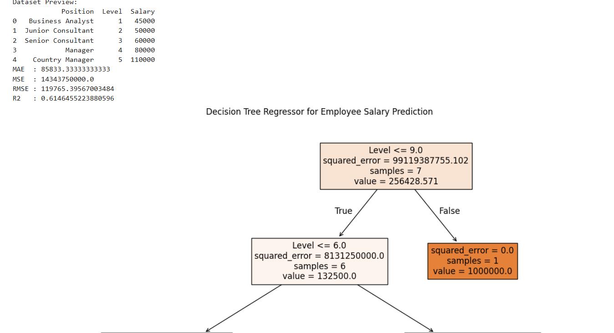
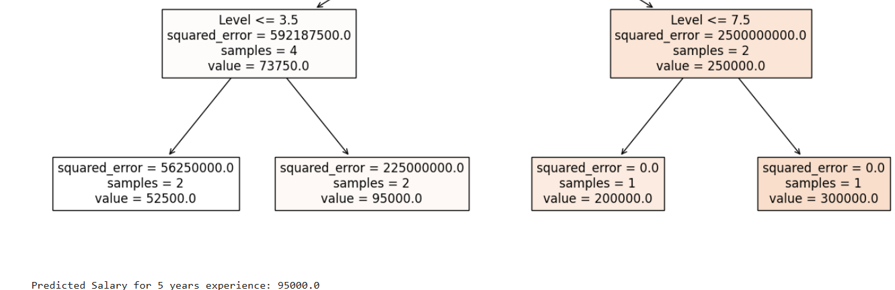

# Implementation-of-Decision-Tree-Regressor-Model-for-Predicting-the-Salary-of-the-Employee

## AIM:
To write a program to implement the Decision Tree Regressor Model for Predicting the Salary of the Employee.

## Equipments Required:
1. Hardware – PCs
2. Anaconda – Python 3.7 Installation / Jupyter notebook

## Algorithm
1.Load the placement dataset, convert the target variable (Placed / Not Placed) into binary form, select SSC percentage and MBA percentage as features, and normalize the feature values.

2.Add a bias term to the input data, initialize model parameters (theta), learning rate, and number of iterations.

3.For each iteration, compute predictions using the sigmoid function, calculate the cost function, compute gradients, and update parameters using gradient descent.

4.Predict the placement status, calculate the accuracy of the model, and plot the cost versus iterations graph.
## Program:
```
# Import required libraries
import pandas as pd
import numpy as np
from sklearn.tree import DecisionTreeRegressor, plot_tree
from sklearn.model_selection import train_test_split
from sklearn.metrics import mean_absolute_error, mean_squared_error, r2_score
import matplotlib.pyplot as plt

# Step 1: Load dataset
df = pd.read_csv("Salary.csv")

print("Dataset Preview:")
print(df.head())

# Step 2: Select features and target
# Change column names if your CSV has different names
X = df[["Level"]]   # Independent variable
y = df["Salary"]              # Dependent variable

# Step 3: Train-Test Split
X_train, X_test, y_train, y_test = train_test_split(
    X, y, test_size=0.3, random_state=42
)

# Step 4: Create Decision Tree Regressor
model = DecisionTreeRegressor(
    criterion="squared_error",
    max_depth=3,
    random_state=42
)

# Step 5: Train the model
model.fit(X_train, y_train)

# Step 6: Make predictions
y_pred = model.predict(X_test)

# Step 7: Evaluate the model
mse = mean_squared_error(y_test, y_pred)
rmse = np.sqrt(mse)

print("MAE  :", mean_absolute_error(y_test, y_pred))
print("MSE  :", mse)
print("RMSE :", rmse)
print("R2   :", r2_score(y_test, y_pred))

# Step 8: Plot Decision Tree
plt.figure(figsize=(16, 10))
plot_tree(
    model,
    feature_names=["Level"],
    filled=True
)
plt.title("Decision Tree Regressor for Employee Salary Prediction")
plt.show()

# Step 9: Predict salary for new employee
new_exp = [[5]]  # 5 years experience
predicted_salary = model.predict(new_exp)
print("\nPredicted Salary for 5 years experience:", predicted_salary[0])
```

## Output:




## Result:
Thus the program to implement the Decision Tree Regressor Model for Predicting the Salary of the Employee is written and verified using python programming.
